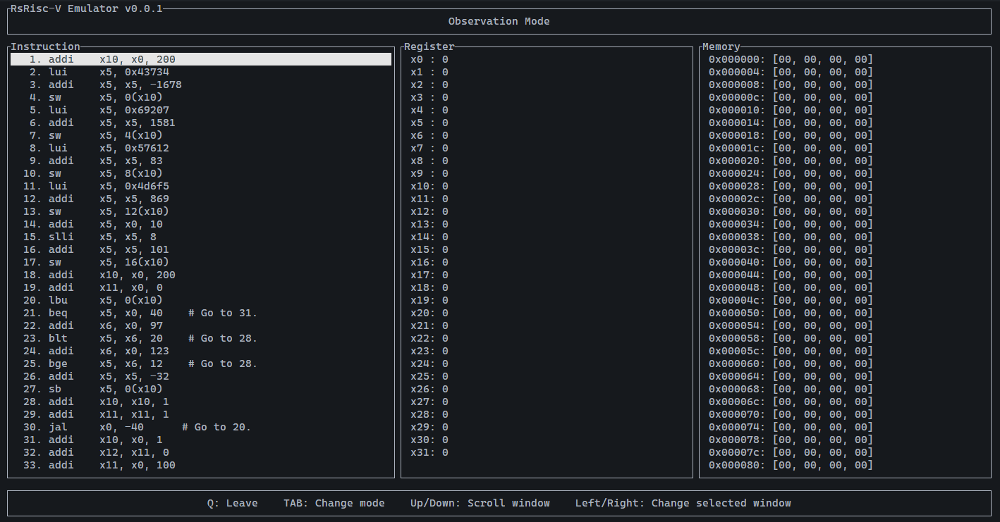

# RsRisc-V Emu: Interactive RV32I Emulator in Rust

[RsRisc-V Asm here](https://github.com/Eender753030/RsRiscV_asm)

## Current Key Features
- **Core RV32I Support**: Implements the base integer instruction set (fetch, decode, execute).
- **Live Inspection**:
    - **Instruction View**: See the disassembled code alongside the binary.
    - **Register View**: Monitor changes in `x0`-`x31`.
    - **Memory View**: Inspect raw data memory dumps with hex formatting.
- **Multiple Execution Modes**:
    - **Observation Mode**: Browse memory/registers without executing code.
    - **Debug Mode (Stay)**: Step-by-step execution (`S`) with Reset (`R`) capability.
    - **Running Mode**: Execute the full binary until completion or interrupt.

## Demo


## Quick Start
### Prerequisites
- Rust toolchain (stable) installed.

### Installation

```bash
# Clone the repository
git clone https://github.com/Eender753030/RsRiscV_emu.git
cd RsRiscV_emu

# Build the project in release mode for best performance
cargo build --release
```
### Usage
Run the emulator by passing a binary file (machine code) as an argument:

```Bash

# Syntax
cargo run --release <path_to_binary_file>

# Example
cargo run --release ./test
```
**Note**: The input file must be a raw binary containing RISC-V RV32I machine code (Little Endian).

## 🎮 Controls & Key Bindings

The UI is designed to be keyboard-centric for efficiency.

| Context | Key | Action | Description |
| :--- | :--- | :--- | :--- |
| **General** | `Tab` | **Switch Mode** | Toggle between **Observation** (Browse) and **Emulate** (Debug) modes. |
|             | `Q` | **Quit** | Exit the application immediately. |
| **Navigation**<br>*(Observation)* | `←` / `→` | **Change Panel** | Move focus between Instruction, Register, and Memory panels. |
| | `↑` / `↓` | **Scroll** | Scroll through the lists in the currently active panel. |
| **Debug**<br>*(Emulate)* | `S` | **Step** | Execute the next instruction (Single-step). |
| | `P` | **Run to End** | Continuously execute instructions until program exit or error. |
| | `R` | **Reset** | Reset PC to initial state and clear registers/memory. |

## License

This project is licensed under the MIT License - see the [LICENSE](LICENSE) file for details.